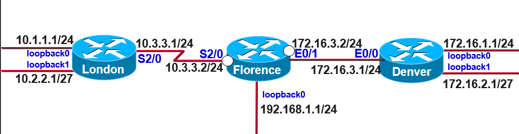

## 静态路由



```bash
#London
ip route 172.16.1.0 255.255.255.0 10.3.3.2
ip route 172.16.2.0 255.255.255.224 10.3.3.2
ip route 172.16.3.0 255.255.255.0 10.3.3.2
ip route 192.168.1.0 255.255.255.0 10.3.3.2

r1(config)# do sh ip route
Codes: L - local, C - connected, S - static, R - RIP, M - mobile, B - BGP
       D - EIGRP, EX - EIGRP external, O - OSPF, IA - OSPF inter area
       N1 - OSPF NSSA external type 1, N2 - OSPF NSSA external type 2
       E1 - OSPF external type 1, E2 - OSPF external type 2
       i - IS-IS, su - IS-IS summary, L1 - IS-IS level-1, L2 - IS-IS level-2
       ia - IS-IS inter area, * - candidate default, U - per-user static route
       o - ODR, P - periodic downloaded static route, H - NHRP, l - LISP
       + - replicated route, % - next hop override

Gateway of last resort is not set

      10.0.0.0/8 is variably subnetted, 6 subnets, 3 masks
C        10.1.1.0/24 is directly connected, Loopback0
L        10.1.1.1/32 is directly connected, Loopback0
C        10.2.2.0/27 is directly connected, Loopback1
L        10.2.2.1/32 is directly connected, Loopback1
C        10.3.3.0/24 is directly connected, Serial2/0
L        10.3.3.1/32 is directly connected, Serial2/0
      172.16.0.0/16 is variably subnetted, 3 subnets, 2 masks
S        172.16.1.0/24 [1/0] via 10.3.3.2
S        172.16.2.0/27 [1/0] via 10.3.3.2
S        172.16.3.0/24 [1/0] via 10.3.3.2
S     192.168.1.0/24 [1/0] via 10.3.3.2

# Florence
ip route 10.1.1.0 255.255.255.0 10.3.3.1
ip route 10.2.2.0 255.255.255.224 Serial2/0
ip route 172.16.1.0 255.255.255.0 172.16.3.1
ip route 172.16.2.0 255.255.255.224 172.16.3.1

# Denver - default route
ip route 0.0.0.0 0.0.0.0 172.16.3.2

# 或者Denver - summary route
ip route 10.0.0.0 255.0.0.0 172.16.3.2
ip route 192.168.1.0 255.255.255.0 172.16.3.2

```
