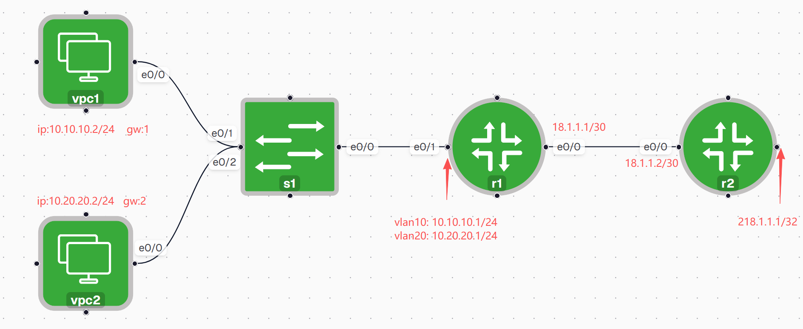
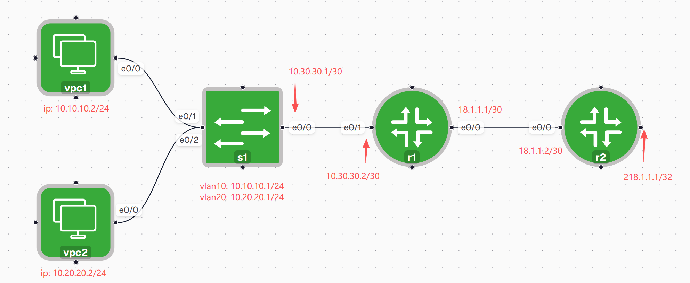

## 单臂路由



s1:

```bash
vlan 10
vlan 20

interface Ethernet0/0
 switchport trunk encapsulation dot1q
 switchport mode trunk
!
interface Ethernet0/1
 switchport access vlan 10
 switchport mode access
!
interface Ethernet0/2
 switchport access vlan 20
 switchport mode access

```

r1：

```bash
interface Ethernet0/0
 ip address 18.1.1.1 255.255.255.252
 no shutdown
!

interface Ethernet0/1
 no ip address
 no shutdown
!
interface Ethernet0/1.10
 encapsulation dot1Q 10
 ip address 10.10.10.1 255.255.255.0
!
interface Ethernet0/1.20
 encapsulation dot1Q 20
 ip address 10.20.20.1 255.255.255.0
!

ip route 0.0.0.0 0.0.0.0 18.1.1.2
```

r2:

```bash
interface Loopback0
 ip address 218.1.1.1 255.255.255.255
!
interface Ethernet0/0
 ip address 18.1.1.2 255.255.255.252
!
ip route 10.0.0.0 255.0.0.0 18.1.1.1
```

## 三层交换机



s1：

```bash
vlan 10
vlan 20
!
interface Ethernet0/0
 no switchport
 ip address 10.30.30.1 255.255.255.252
!
interface Ethernet0/1
 switchport access vlan 10
 switchport mode access
 duplex auto
!
interface Ethernet0/2
 switchport access vlan 20
 switchport mode access
 duplex auto
!
# 开启三层路由功能
ip routing
!
interface Vlan10
 ip address 10.10.10.1 255.255.255.0
!
interface Vlan20
 ip address 10.20.20.1 255.255.255.0
!
ip route 0.0.0.0 0.0.0.0 10.30.30.2
```

r1:

```bash

interface Ethernet0/0
 ip address 18.1.1.1 255.255.255.252
!
interface Ethernet0/1
 ip address 10.30.30.2 255.255.255.252
!

ip route 0.0.0.0 0.0.0.0 18.1.1.2
ip route 10.10.10.0 255.255.255.0 10.30.30.1
ip route 10.20.20.0 255.255.255.0 10.30.30.1
```

r2:

```bash
!
interface Loopback0
 ip address 218.1.1.1 255.255.255.255
!
interface Ethernet0/0
 ip address 18.1.1.2 255.255.255.252
!
ip route 10.0.0.0 255.0.0.0 18.1.1.1
```
