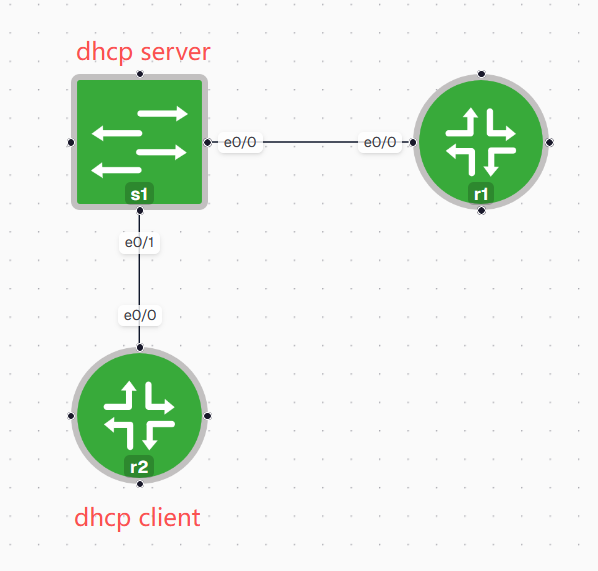
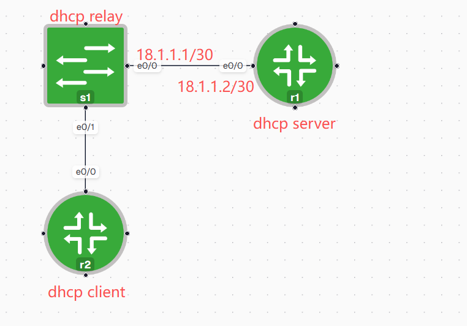

s1:

```bash
vlan 10
!
interface Vlan10
 ip address 10.10.10.1 255.255.255.0
!
interface Ethernet0/1
 switchport access vlan 10
 switchport mode access
!
ip dhcp excluded-address 10.10.10.1 10.10.10.63
!
ip dhcp pool mydhcpvlan10
 network 10.10.10.0 255.255.255.0
 default-router 10.10.10.1
 dns-server 8.8.8.8

```

r2-dhcpclient:

```bash
dhcpclient(config)#int e0/0
dhcpclient(config-if)#ip address dhcp
dhcpclient(config-if)#no shutdown

*Apr  6 21:44:31.349: %DHCP-6-ADDRESS_ASSIGN: Interface Ethernet0/0 assigned DHCP address 10.10.10.64, mask 255.255.255.0, hostname dhcpclient
```

s1:

```bash
s1# sh ip dhcp binding
Bindings from all pools not associated with VRF:
IP address          Client-ID/              Lease expiration        Type
                    Hardware address/
                    User name
10.10.10.64         0063.6973.636f.2d61.    Apr 06 2026 09:49 PM    Automatic
                    6162.622e.6363.3030.
                    2e31.6330.302d.4574.
                    302f.30
```



s1:

```bash
vlan 10
ip routing
!
interface Ethernet0/0
 no switchport
 ip address 18.1.1.1 255.255.255.252
!
interface Ethernet0/1
 switchport access vlan 10
 switchport mode access
!
interface Vlan10
 ip address 10.10.10.1 255.255.255.0
 ip helper-address 18.1.1.2
```

r1:

```bash
ip dhcp excluded-address 10.10.10.1 10.10.10.31
!
ip dhcp pool testvlan10
network 10.10.10.0 255.255.255.0
default-router 10.10.10.1
dns-server 8.8.8.8
!
interface Ethernet0/0
ip address 18.1.1.2 255.255.255.252
!
ip route 10.0.0.0 255.0.0.0 18.1.1.1


r1(config)#do sh ip dhcp binding
Bindings from all pools not associated with VRF:
IP address          Client-ID/              Lease expiration        Type
                    Hardware address/
                    User name
10.10.10.32         0063.6973.636f.2d61.    Apr 07 2026 09:59 PM    Automatic
                    6162.622e.6363.3030.
                    2e31.6330.302d.4574.
                    302f.30
```

r2-dhcpclient

```bash
dhcpclient(config)#int e0/0
dhcpclient(config-if)#ip address dhcp
dhcpclient(config-if)#no shut

*Apr  6 21:59:29.929: %DHCP-6-ADDRESS_ASSIGN: Interface Ethernet0/0 assigned DHCP address 10.10.10.32, mask 255.255.255.0, hostname dhcpclient
```
