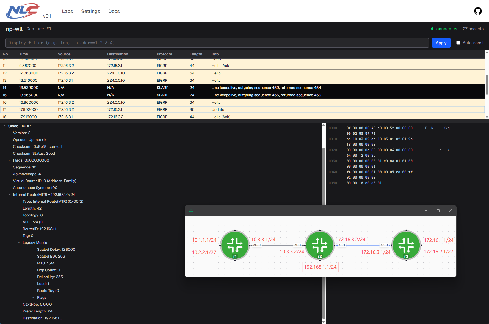

```bash
# R1
router eigrp 100
 network 10.1.1.0 0.0.0.255
 network 10.2.2.1 0.0.0.0
 network 10.3.3.0 0.0.0.255

# R2
router eigrp 100
 network 10.3.3.2 0.0.0.0
 network 172.16.0.0   # 等同于 172.16.0.0 0.0.255.255, B类默认，就不显示反掩码了
 network 192.168.1.0  # 等同于 192.168.1.0 0.0.0.255, C类默认，就不显示反掩码了

# R3
router eigrp 100
 network 0.0.0.0      # 等同于 0.0.0.0 255.255.255.255
```

```text
network命令的意义：哪些接口需要启用eigrp，eigrp的network命令支持反掩码，可以做到比rip更精细的控制粒度

administrative distance: 90 / 170

组播地址：224.0.0.10

metric:
[K1 x BW + (K2 x BW) / (256 - load) + K3 x delay] x [K5 / (reliability + K4)]
By default: K1 = 1, K2 = 0, K3 = 1, K4 = 0, K5 = 0
Delay = [Delay in 10s of microseconds] x 256
Bandwidth = [10000000 / (bandwidth in Kbps)] x 256

ethernet 0/0: BW 10000 Kbit/sec, DLY 1000 usec
serial 2/0: BW 1544 Kbit/sec, DLY 20000 usec,
loopback: BW 8000000 Kbit/sec, DLY 5000 usec,
```
