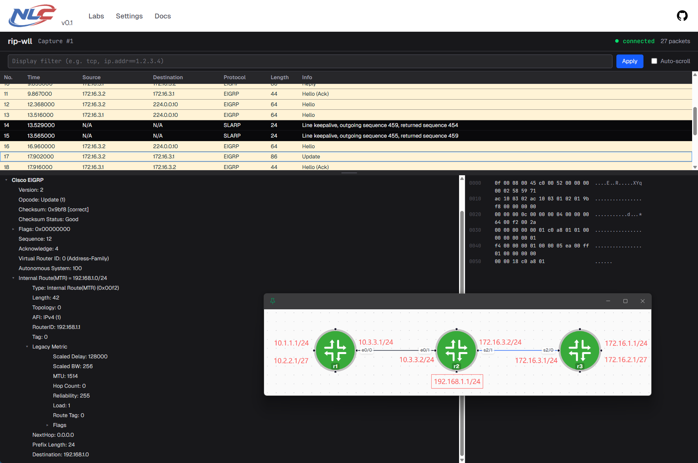

```bash
# R1
router eigrp 100
 network 10.1.1.0 0.0.0.255
 network 10.2.2.1 0.0.0.0
 network 10.3.3.0 0.0.0.255

# R2
router eigrp 100
 network 10.3.3.2 0.0.0.0
 network 172.16.0.0   # 等同于 172.16.0.0 0.0.255.255, B类默认，就不显示反掩码了
 network 192.168.1.0  # 等同于 192.168.1.0 0.0.0.255, C类默认，就不显示反掩码了

# R3
router eigrp 100
 network 0.0.0.0      # 等同于 0.0.0.0 255.255.255.255
```

```text
network命令的意义：哪些接口需要启用eigrp，eigrp的network命令支持反掩码，可以做到比rip更精细的控制粒度

administrative distance: 90 / 170

组播地址：224.0.0.10

metric:
[K1 x BW + (K2 x BW) / (256 - load) + K3 x delay] x [K5 / (reliability + K4)]
By default: K1 = 1, K2 = 0, K3 = 1, K4 = 0, K5 = 0
Delay = [Delay in 10s of microseconds] x 256
Bandwidth = [10000000 / (bandwidth in Kbps)] x 256

ethernet 0/0: BW 10000 Kbit/sec, DLY 1000 usec
serial 2/0: BW 1544 Kbit/sec, DLY 20000 usec,
loopback: BW 8000000 Kbit/sec, DLY 5000 usec,
```


## 一、基本概念

EIGRP（Enhanced Interior Gateway Routing Protocol）是 Cisco 私有的**高级距离矢量协议（也称混合型协议）**，结合了距离矢量协议的简单性和链路状态协议的快速收敛能力，核心依赖 **DUAL（Diffusing Update Algorithm，弥散更新算法）** 实现无环快速收敛。

---

## 二、核心参数速查表

| 参数 | 值 | 说明 |
|---|---|---|
| 管理距离（AD） | **内部路由 90 / 外部路由 170** | 内部指 EIGRP 域内学到的路由，外部指重分发进来的路由 |
| 度量值（Metric） | 复合值，默认由**带宽 + 延迟**决定 | 比 RIP 的跳数更精细，能反映链路真实质量 |
| 组播地址 | **224.0.0.10** | EIGRP Hello / Update 报文目的地址 |
| 协议号 | IP 协议号 88 | 直接封装在 IP 之上，不用 UDP/TCP |
| Hello 间隔 | 5s（高速链路）/ 60s（慢速链路，如帧中继） | 决定邻居检测速度 |
| Hold 时间 | 默认为 Hello 的 3 倍（15s / 180s） | 超过此时间未收到 Hello，判定邻居失效 |

---

## 三、Metric 计算公式（重点）

```
Metric = [K1×BW + (K2×BW)/(256−load) + K3×Delay] × [K5/(reliability+K4)]

默认：K1=1, K2=0, K3=1, K4=0, K5=0
简化后（默认K值下）：Metric = 256 × (10^7 / BW_min + ΣDelay/10)
```

### 计算用参数换算
```
Bandwidth 项 = [10,000,000 / (带宽，单位Kbps)] × 256
Delay 项     = [延迟，单位为10微秒] × 256
```

### 常见接口默认值（用于手算）
| 接口类型 | 带宽（BW） | 延迟（DLY） |
|---|---|---|
| Ethernet 0/0 | 10000 Kbit/s | 1000 usec |
| Serial 2/0（默认串口） | 1544 Kbit/s | 20000 usec |
| Loopback | 8000000 Kbit/s | 5000 usec |

> **实践要点**：EIGRP 的 metric 取路径上**最小带宽**（瓶颈带宽）+ **累计延迟**，这也是为什么它比 RIP 更能反映真实链路质量——即便跳数少，如果中间有一段低速链路，metric 依然会很大。

### 手算示例
假设路径为 R1（Ethernet, BW=10000）→ R2 → R3（Serial, BW=1544）：
- 瓶颈带宽取路径中最小值：1544 Kbps
- 延迟累加：1000 + 20000 = 21000 usec → 转换为10微秒单位 = 2100
- Bandwidth 项 = (10,000,000 / 1544) × 256 ≈ 1,657,856
- Delay 项 = 2100 × 256 = 537,600
- Metric ≈ 1,657,856 + 537,600 = 2,195,456

可以用 `show ip eigrp topology` 里显示的 FD（Feasible Distance）反推验证这个手算结果。

---
## 四、DUAL 算法相关术语

| 术语 | 含义 |
|---|---|
| **FD**（Feasible Distance） | 到目标网络的最优（最小）metric |
| **AD**（Advertised/Reported Distance） | 邻居通告给你的、它自己到目标网络的metric |
| **Successor**（后继） | 到达目标的最优下一跳，被放入路由表 |
| **Feasible Successor**（可行后继，FS） | 备份路径，满足 **可行性条件（Feasibility Condition, FC）**：该邻居的 AD < 本地FD，一旦主路径失效可**无需重新计算即时切换**，这是 EIGRP 收敛快的核心原因 |
| **主动（Active）/ 被动（Passive）状态** | 路由正常稳定时为 Passive；当 Successor 失效且没有可行后继时，进入 Active 状态，向所有邻居发送 Query 主动查询新路径 |
