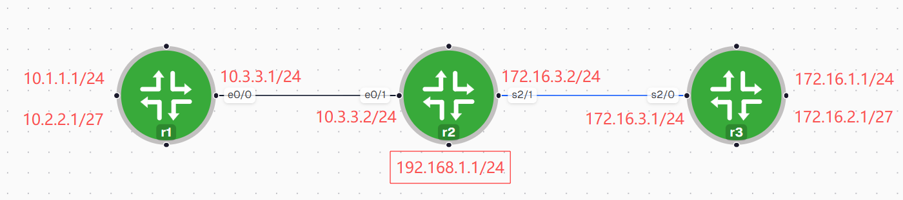

```bash


r2#show ip ospf int e0/1
Ethernet0/1 is up, line protocol is up
  Internet Address 10.3.3.2/24, Area 0, Attached via Network Statement
  Process ID 1, Router ID 2.2.2.2, Network Type BROADCAST, Cost: 10
  Topology-MTID    Cost    Disabled    Shutdown      Topology Name
        0           10        no          no            Base
  Transmit Delay is 1 sec, State BDR, Priority 1
  Designated Router (ID) 1.1.1.1, Interface address 10.3.3.1
  Backup Designated router (ID) 2.2.2.2, Interface address 10.3.3.2
  Timer intervals configured, Hello 10, Dead 40, Wait 40, Retransmit 5
    oob-resync timeout 40
    Hello due in 00:00:09
  Supports Link-local Signaling (LLS)
  Cisco NSF helper support enabled
  IETF NSF helper support enabled
  Index 1/1, flood queue length 0
  Next 0x0(0)/0x0(0)
  Last flood scan length is 1, maximum is 1
  Last flood scan time is 0 msec, maximum is 0 msec
  Neighbor Count is 1, Adjacent neighbor count is 1
    Adjacent with neighbor 1.1.1.1  (Designated Router)
  Suppress hello for 0 neighbor(s)


r3#show ip ospf int s2/0
Serial2/0 is up, line protocol is up
  Internet Address 172.16.3.1/24, Area 0, Attached via Network Statement
  Process ID 1, Router ID 3.3.3.3, Network Type POINT_TO_POINT, Cost: 64
  Topology-MTID    Cost    Disabled    Shutdown      Topology Name
        0           64        no          no            Base
  Transmit Delay is 1 sec, State DOWN
  Timer intervals configured, Hello 10, Dead 40, Wait 40, Retransmit 5
    oob-resync timeout 40


r2#show ip ospf nei

Neighbor ID     Pri   State           Dead Time   Address         Interface
3.3.3.3           0   FULL/  -        00:00:34    172.16.3.1      Serial2/1
1.1.1.1           1   FULL/DR         00:00:31    10.3.3.1        Ethernet0/1


R3:
router ospf 1
 router-id 3.3.3.3
 network 0.0.0.0 255.255.255.255 area 0


或者：

!
!
!
!
interface Loopback0
 ip address 172.16.1.1 255.255.255.0
 ip ospf network point-to-point
 ip ospf 1 area 0
!
interface Loopback1
 ip address 172.16.2.1 255.255.255.224
 ip ospf 1 area 0
!
interface Serial2/0
 ip address 172.16.3.1 255.255.255.0
 ip ospf 1 area 0
 serial restart-delay 0
!
!
router ospf 1
 router-id 3.3.3.3
!
!


r3#show ip ospf database

            OSPF Router with ID (3.3.3.3) (Process ID 1)

                Router Link States (Area 0)

Link ID         ADV Router      Age         Seq#       Checksum Link count
1.1.1.1         1.1.1.1         141         0x80000005 0x0004DA 3
2.2.2.2         2.2.2.2         305         0x80000009 0x0085C0 4
3.3.3.3         3.3.3.3         163         0x80000005 0x00134C 4

                Net Link States (Area 0)

Link ID         ADV Router      Age         Seq#       Checksum
10.3.3.1        1.1.1.1         141         0x80000002 0x0034E3

```


## 1. 基本特性

- **链路状态路由协议**（Link-State Routing Protocol）
- 依赖 **IP 数据包**传送路由信息（不像 EIGRP 走独立协议号封装描述那样简单，OSPF本身也是直接封装在IP层之上）
- 使用 **IP 协议号 89**
- **仅支持 IP 环境**（这是它和一些多协议路由协议的区别，OSPF从设计上就是IP专属）
- **支持等价负载均衡**（Equal-Cost Multi-Path，多条Cost相同的路径可同时用于转发）

### 协议号对照（帧结构位置）

```
Frame Header | IP Header(Protocol Number) | Packet Payload | CRC
```

常见协议号：

| 协议号 | 协议     |
| ------ | -------- |
| 6      | TCP      |
| 17     | UDP      |
| **89** | **OSPF** |

> 这说明 OSPF 报文在网络层直接被识别和处理，不经过传输层（TCP/UDP），这也是它比基于UDP的RIP更"底层"、开销更小的原因之一。

---

## 2.链路状态路由协议的三张表结构

| 表名                                              | 内容                                          | 类比           |
| ------------------------------------------------- | --------------------------------------------- | -------------- |
| **Neighbor Table**（邻居表）                      | 列出所有建立了邻接关系的邻居                  | "我认识谁"     |
| **Topology Table**（拓扑表 / LSDB链路状态数据库） | 整个网络的地图，每台路由器视角一致            | "全网长什么样" |
| **Routing Table**（路由表）                       | 经过SPF算法计算后，列出到每个目的地的最优路由 | "去哪条路最快" |

### OSPF 与 EIGRP 结构对比

| 层级           | OSPF                                             | EIGRP                                                          |
| -------------- | ------------------------------------------------ | -------------------------------------------------------------- |
| 邻居表         | 列出所有邻居                                     | 列出所有邻居                                                   |
| 拓扑表         | **全网络的地图**（LSDB，所有路由器视角完全一致） | **邻居的路由表集合**（每个邻居告诉我它自己知道的路由和metric） |
| 路由表生成方式 | 基于LSDB运行 **SPF算法** 独立计算                | 直接从拓扑表里 **选出最好的路由**（DUAL算法比较FD/AD）         |
| 路由表         | 路由转发表                                       | 路由转发表                                                     |

> **核心区别**：OSPF的拓扑表是"上帝视角"的全网地图（每台路由器算出来的最短路径树理论上应该完全一致）；EIGRP的拓扑表本质是"我所有邻居各自认为的到目的地的距离"的汇总，是一种更"局部"的视角。这也是为什么OSPF需要运行SPF这种全局计算算法，而EIGRP只需要在已有的邻居通告里做比较（DUAL），计算量更小、更快，但对全网拓扑的掌握不如OSPF精确。

---

## 3.区域划分

OSPF 需要**层次化的网络结构**，包含两种层次的区域：

- **传输区域**（骨干区域，Area 0）
- **普通区域**（非骨干区域）

### 为什么要划分区域（四大理由）

1. **减小路由表大小**——区域间只传递汇总路由，不传递明细
2. **限制 LSA 的扩散**——LSA泛洪被限制在区域内部，不会全网泛滥
3. **加快 OSPF 收敛速度**——区域内SPF计算范围变小，重新计算更快
4. **增强 OSPF 稳定性**——某个区域内的链路抖动不会直接影响其他区域的SPF重新计算

---

## 4.报文类型

| 报文                                   | 中文名       | 作用                                       |
| -------------------------------------- | ------------ | ------------------------------------------ |
| **Hello**                              | Hello包      | 建立/维护邻居关系                          |
| **Database Description**（DBD）        | 数据库描述包 | 描述自己的LSDB内容摘要（"广告"自己有什么） |
| **Link-State Request**（LSR）          | 链路状态请求 | 向邻居请求某一段具体的链路状态详细信息     |
| **Link-State Update**（LSU）           | 链路状态更新 | 携带LSA的集合，真正的路由信息载体          |
| **Link-State Acknowledgment**（LSAck） | 确认包       | 对可靠传输（LSU）的确认回应                |

---

## 5.邻居关系建立全过程


```
Down → Init → Two-Way → ExStart → Exchange → Loading → Full
```

| 状态     | 关键动作                         | 用到的报文      |
| -------- | -------------------------------- | --------------- |
| Down     | 尚未收到任何Hello                | —               |
| Init     | 收到Hello，但对方未列出自己      | Hello           |
| Two-Way  | 双向确认看到对方                 | Hello           |
| ExStart  | 协商Master/Slave                 | Hello           |
| Exchange | 交换数据库摘要                   | DBD, LSAck      |
| Loading  | 请求并获取缺失的详细LSA          | LSR, LSU, LSAck |
| **Full** | 数据库完全同步，邻接关系建立完成 | —               |


---

## 6.LSA 序列号与 MaxAge 老化机制

- **LSA 序列号**：32位长，从 `0x80000001` 开始，最大到 `0x7fffffff`
    - 序列号越大，代表LSA越新
    - 用来判断LSA的新旧以及是否重复收到
- **MaxAge 计数器**：OSPF为LSDB中**每一条LSA**都单独维护一个老化计数器
    - 默认 **1小时**（3600秒）超时后，这条LSA会被从LSDB中删除
    - **每隔30分钟**，OSPF会重新泛洪一次所有LSA（即使内容没变化），用来确保全网数据库同步
    - 每次泛洪时，序列号 **+1**
    - 收到LSA更新时，会**重启（刷新）**该条目的MaxAge计数器（重新从0开始计时）
- **序列号回绕处理**：当一条LSA存在时间足够长，序列号快要用完（接近0x7fffffff）时，需要让它**提前老化**（手动把MaxAge设为1小时使其立即过期）并 **flush**（清除），然后重新从`0x80000001`开始计数

---

## 7.`debug ip ospf packet` 解读

示例：

```
OSPF: rcv. v:2 t:1 l:48 rid:200.0.0.117 aid:0.0.0.0 chk:6AB2 aut:0 auk:
```

| 字段      | 含义                                              |
| --------- | ------------------------------------------------- |
| **v**     | OSPF 版本号                                       |
| **t**     | OSPF包类型：1=Hello, 2=DBD, 3=LSR, 4=LSU, 5=LSAck |
| **l**     | OSPF包长度                                        |
| **rid**   | Router ID（发送方的路由器ID）                     |
| **aid**   | Area ID（区域号，`0.0.0.0`即Area 0）              |
| **chk**   | Checksum（校验和）                                |
| **aut**   | OSPF认证类型：0=无认证，1=明文密码，2=MD5         |
| **auk**   | Authentication key（认证密钥内容）                |
| **keyid** | MD5 key ID（如果用MD5认证，标识具体使用哪把密钥） |
| **seq**   | 序列号（用于防重放攻击，配合MD5认证使用）         |

> 上面示例：`t:1` 表示这是一个Hello包，`aid:0.0.0.0` 说明该接口属于Area 0，`aut:0` 说明当前未启用任何认证。

**实践用途**：这是排查OSPF邻居建立异常时最直接的手段之一——直接看收发的是哪种报文类型、区域号是否匹配、认证是否一致，比单纯看`show`命令的静态结果更能定位"卡在哪一步"的问题。