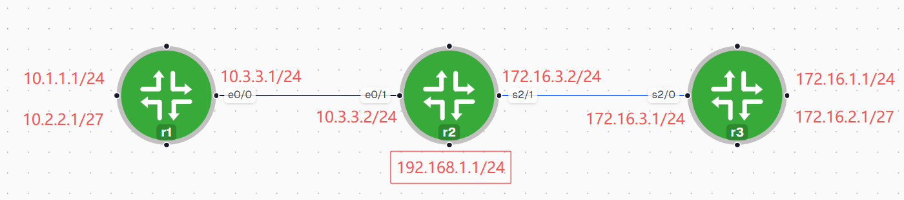
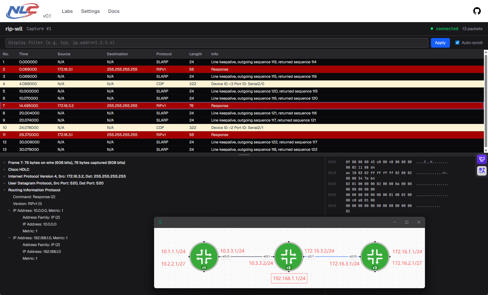
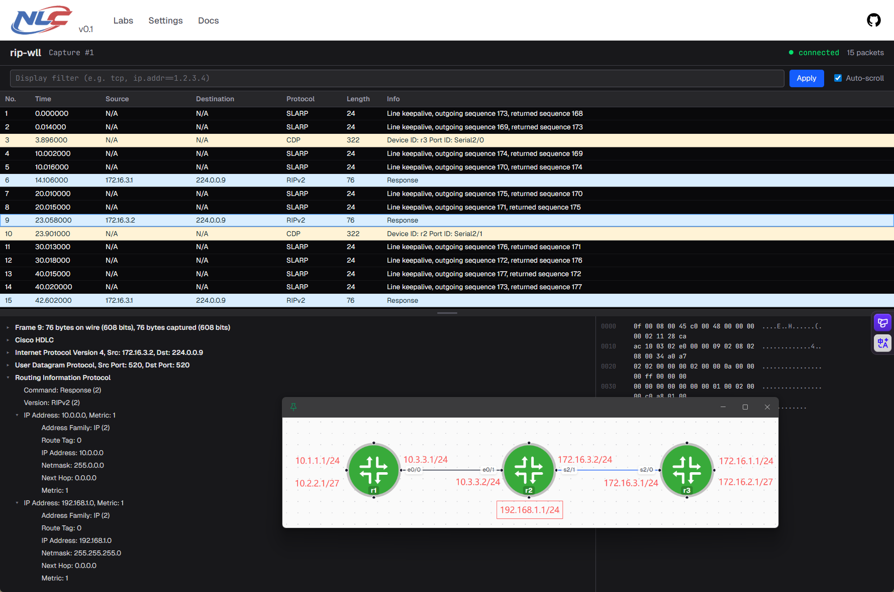

```bash
# R1
router rip
 version 2
 network 10.0.0.0

# R2
router rip
 version 2
 network 10.0.0.0
 network 172.16.0.0
 network 192.168.1.0
 no auto-summary

# R3
router rip
 version 2
 network 172.16.0.0
```

```text
network命令的意义：哪些接口需要启用rip

administrative distance: 120

metric: hop

v1广播，v2组播 224.0.0.9
v1不带子网掩码，不支持VLSM（可变长子网掩码）
v2带子网掩码，支持VLSM

每隔 30s 广播/组播一次；
holdown timer：180s，在路由表中标记possiblity down；
240s 从路由表删除
```
