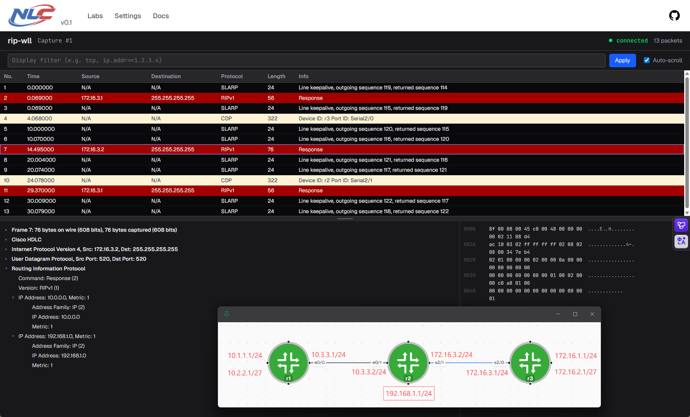
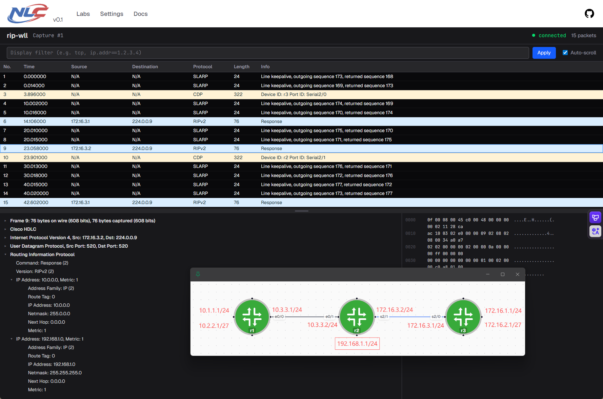

```bash
# R1
router rip
 version 2
 network 10.0.0.0

# R2
router rip
 version 2
 network 10.0.0.0
 network 172.16.0.0
 network 192.168.1.0
 no auto-summary

# R3
router rip
 version 2
 network 172.16.0.0
```

```text
network命令的意义：哪些接口需要启用rip

administrative distance: 120

metric: hop

v1广播，v2组播 224.0.0.9
v1不带子网掩码，不支持VLSM（可变长子网掩码）
v2带子网掩码，支持VLSM

每隔 30s 广播/组播一次；
holdown timer：180s，在路由表中标记possiblity down；
240s 从路由表删除
```


## 一、基本概念

RIP（Routing Information Protocol）是一种**距离矢量（Distance Vector）路由协议**。是最早期、最简单的动态路由协议，适合小型网络。

---

## 二、版本对比

| 特性 | RIPv1 | RIPv2 |
|---|---|---|
| 通告方式 | 广播 255.255.255.255 | 组播 **224.0.0.9** |
| 子网掩码携带 | 不携带 | 携带（支持 **VLSM**，可变长子网掩码） |
| CIDR 支持 | 不支持 | 支持 |
| 认证 | 不支持 | 支持（明文 / MD5） |
| 自动汇总 | 强制开启 | 默认开启，可用 `no auto-summary` 关闭 |

> **实践建议**：现在基本只用 RIPv2，配置时必须写 `version 2`，否则默认是 v1，VLSM 环境下会出问题。

---

## 三、核心参数速查表

| 参数 | 值 | 说明 |
|---|---|---|
| 管理距离（AD） | **120** | 数值越小越优先，RIP 在常见协议里可信度最低（仅比未知/240高一点） |
| 度量值（Metric） | **跳数（hop count）** | 每经过一台路由器 +1，不考虑带宽、延迟 |
| 最大跳数 | **15** | 16 表示不可达（无穷大），超过则判定网络不可达 |
| 组播地址（v2） | 224.0.0.9 | RIPv2 更新报文的目的地址 |
| 默认端口 | UDP 520 | — |

---

## 四、四个定时器

| 定时器 | 时间 | 作用 |
|---|---|---|
| **Update**（更新） | 30s | 周期性向邻居发送完整路由表 |
| **Invalid**（失效） | 180s | 超过此时间未收到某条路由更新，标记为 possibly down |
| **Holddown**（保持） | 180s | 路由标记不可达后，此期间内不接受关于该路由的"更差"更新，防止路由抖动/环路 |
| **Flush**（清除） | 240s | 超时后彻底从路由表删除该条目 |

> **抓包验证要点**：实际更新间隔常在 25-30s 之间波动（Cisco 实现加入随机负向抖动），这是为了防止多台路由器更新包同步冲突，**属于正常现象，不是异常**。

---

## 五、防环机制

RIP 作为距离矢量协议天生容易产生环路，依赖以下机制预防：

1. **水平分割（Split Horizon）**：从某接口学到的路由，不会再从该接口通告回去
2. **毒性逆转（Poison Reverse）**：配合水平分割，反向通告时把度量设为 16（不可达），更明确阻止环路
3. **触发更新（Triggered Update）**：拓扑变化时立即发送更新，不等待 30s 周期，加快收敛
4. **最大跳数限制**：15 跳限制本身也是一种朴素防环手段

## 六、测试验证方法（按顺序排查）

### 1. 检查 RIP 进程与接口声明
```
show ip protocols
```
确认 "Routing for Networks" 和 "Interface" 列表与预期一致，同时可看到当前 version、是否 no auto-summary。

### 2. 检查 RIP 数据库（核心排查手段）
```
show ip rip database
```
- 能看到 RIP 学到的**所有路由条目**及来源
- **关键判断点**：如果这里看到的是 `10.0.0.0/8` 而不是精确的 `10.1.1.0/24` + `10.2.2.0/27`，说明自动汇总没关干净

### 3. 检查最终路由表
```
show ip route rip
```
确认掩码是否为精确子网（如 /27），而非被汇总后的主类网段。

### 4. 端到端连通性测试（建议专挑 VLSM 子网测试）
```
ping 172.16.2.1 source 10.2.2.1
```
特意用两端的 /27 子网互测，专门验证 VLSM 是否真正生效，比整段网段互通更能暴露掩码问题。

### 5. 报文抓取分析（Wireshark）
- 过滤 `rip` 或查看目的地址 `224.0.0.9`
- **正常现象**：
  - 更新间隔在 25-30s 波动（随机抖动）
  - 不同路由器的更新包长度不同（连接的网段数量越多，携带路由条目越多，包越大）
  - 两端更新周期彼此独立、不同步
- **重点排查**：展开某个 RIP 包详情，查看 Routing Information Protocol → IP Address / Subnet Mask / Metric 字段，直接确认通告的子网掩码是否精确（这是验证 auto-summary 是否生效最直接的方法）

### 6. 抓包时的干扰项识别（不是RIP问题）
| 帧类型 | 特征 | 说明 |
|---|---|---|
| LOOP | 约每10秒一次，MAC地址互发 | 模拟器（GNS3/EVE-NG）的二层保活帧，与路由协议无关 |
| CDP | 约每60秒一次，携带 Device ID / Port ID | Cisco 默认邻居发现协议，属正常底层机制 |
