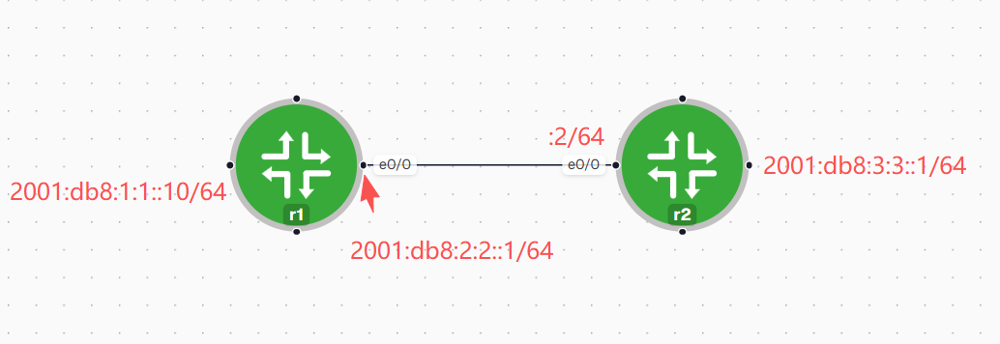

r1:

```bash
ipv6 unicast-routing

interface Loopback0
 no ip address
 ipv6 address 2001:DB8:1:1::10/64
!
interface Ethernet0/0
 no ip address
 ipv6 address 2001:DB8:2:2::1/64
!
ipv6 route 2001:DB8:3:3::/64 2001:DB8:2:2::2
```

r2:

```bash
ipv6 unicast-routing
!
interface Loopback0
 no ip address
 ipv6 address 2001:DB8:3:3::1/64
!
interface Ethernet0/0
 no ip address
 ipv6 address 2001:DB8:2:2::2/64
!
ipv6 route 2001:DB8:1:1::/64 2001:DB8:2:2::1
!
```

ospfv3:

```bash
#r1
ipv6 unicast-routing
!
interface Loopback0
 no ip address
 ipv6 address 2001:DB8:1:1::10/64
 ipv6 ospf 1 area 0
!
interface Ethernet0/0
 no ip address
 ipv6 address 2001:DB8:2:2::1/64
 ipv6 ospf 1 area 0
!
router ospfv3 1
 router-id 1.1.1.1
 !
 address-family ipv6 unicast
 exit-address-family


#r2
ipv6 unicast-routing
!
interface Loopback0
 no ip address
 ipv6 address 2001:DB8:3:3::1/64
 ipv6 ospf 1 area 0
 ipv6 ospf network point-to-point
!
interface Ethernet0/0
 no ip address
 ipv6 address 2001:DB8:2:2::2/64
 ipv6 ospf 1 area 0
!
router ospfv3 1
 router-id 2.2.2.2
 !
 address-family ipv6 unicast
 exit-address-family
!


#r1

r1#show ipv6 ospf neighbor

            OSPFv3 Router with ID (1.1.1.1) (Process ID 1)

Neighbor ID     Pri   State           Dead Time   Interface ID    Interface
2.2.2.2           1   FULL/DR         00:00:33    2               Ethernet0/0
r1#
r1#
r1#show ipv6 route
IPv6 Routing Table - default - 6 entries
Codes: C - Connected, L - Local, S - Static, U - Per-user Static route
       B - BGP, R - RIP, I1 - ISIS L1, I2 - ISIS L2
       IA - ISIS interarea, IS - ISIS summary, D - EIGRP, EX - EIGRP external
       ND - ND Default, NDp - ND Prefix, DCE - Destination, NDr - Redirect
       O - OSPF Intra, OI - OSPF Inter, OE1 - OSPF ext 1, OE2 - OSPF ext 2
       ON1 - OSPF NSSA ext 1, ON2 - OSPF NSSA ext 2
C   2001:DB8:1:1::/64 [0/0]
     via Loopback0, directly connected
L   2001:DB8:1:1::10/128 [0/0]
     via Loopback0, receive
C   2001:DB8:2:2::/64 [0/0]
     via Ethernet0/0, directly connected
L   2001:DB8:2:2::1/128 [0/0]
     via Ethernet0/0, receive
O   2001:DB8:3:3::/64 [110/11]
     via FE80::A8BB:CCFF:FE00:1D00, Ethernet0/0
L   FF00::/8 [0/0]
     via Null0, receive
```
