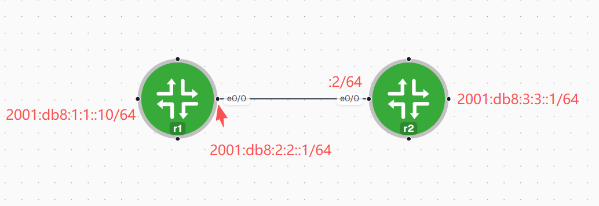

r1:

```bash
ipv6 unicast-routing

interface Loopback0
 no ip address
 ipv6 address 2001:DB8:1:1::10/64
!
interface Ethernet0/0
 no ip address
 ipv6 address 2001:DB8:2:2::1/64
!
ipv6 route 2001:DB8:3:3::/64 2001:DB8:2:2::2
```

r2:

```bash
ipv6 unicast-routing
!
interface Loopback0
 no ip address
 ipv6 address 2001:DB8:3:3::1/64
!
interface Ethernet0/0
 no ip address
 ipv6 address 2001:DB8:2:2::2/64
!
ipv6 route 2001:DB8:1:1::/64 2001:DB8:2:2::1
!
```

ospfv3:

```bash
#r1
ipv6 unicast-routing
!
interface Loopback0
 no ip address
 ipv6 address 2001:DB8:1:1::10/64
 ipv6 ospf 1 area 0
!
interface Ethernet0/0
 no ip address
 ipv6 address 2001:DB8:2:2::1/64
 ipv6 ospf 1 area 0
!
router ospfv3 1
 router-id 1.1.1.1
 !
 address-family ipv6 unicast
 exit-address-family


#r2
ipv6 unicast-routing
!
interface Loopback0
 no ip address
 ipv6 address 2001:DB8:3:3::1/64
 ipv6 ospf 1 area 0
 ipv6 ospf network point-to-point
!
interface Ethernet0/0
 no ip address
 ipv6 address 2001:DB8:2:2::2/64
 ipv6 ospf 1 area 0
!
router ospfv3 1
 router-id 2.2.2.2
 !
 address-family ipv6 unicast
 exit-address-family
!


#r1

r1#show ipv6 ospf neighbor

            OSPFv3 Router with ID (1.1.1.1) (Process ID 1)

Neighbor ID     Pri   State           Dead Time   Interface ID    Interface
2.2.2.2           1   FULL/DR         00:00:33    2               Ethernet0/0
r1#
r1#
r1#show ipv6 route
IPv6 Routing Table - default - 6 entries
Codes: C - Connected, L - Local, S - Static, U - Per-user Static route
       B - BGP, R - RIP, I1 - ISIS L1, I2 - ISIS L2
       IA - ISIS interarea, IS - ISIS summary, D - EIGRP, EX - EIGRP external
       ND - ND Default, NDp - ND Prefix, DCE - Destination, NDr - Redirect
       O - OSPF Intra, OI - OSPF Inter, OE1 - OSPF ext 1, OE2 - OSPF ext 2
       ON1 - OSPF NSSA ext 1, ON2 - OSPF NSSA ext 2
C   2001:DB8:1:1::/64 [0/0]
     via Loopback0, directly connected
L   2001:DB8:1:1::10/128 [0/0]
     via Loopback0, receive
C   2001:DB8:2:2::/64 [0/0]
     via Ethernet0/0, directly connected
L   2001:DB8:2:2::1/128 [0/0]
     via Ethernet0/0, receive
O   2001:DB8:3:3::/64 [110/11]
     via FE80::A8BB:CCFF:FE00:1D00, Ethernet0/0
L   FF00::/8 [0/0]
     via Null0, receive
```


## 1. 常用配置命令速查

| 命令                               | 作用                                                            |
| ---------------------------------- | --------------------------------------------------------------- |
| `ipv6 unicast-routing`             | 全局开启 IPv6 路由转发功能（前提条件）                          |
| `ipv6 address X::X/64`             | 接口配置 IPv6 地址                                              |
| `ipv6 ospf 1 area 0`               | 在接口下启用 OSPFv3 进程1，加入 area 0                          |
| `router ospfv3 1`                  | 进入 OSPFv3 进程配置模式                                        |
| `router-id x.x.x.x`                | 手动指定 Router ID（IPv6 下没有 IP 地址可自动选，建议手动配置） |
| `ipv6 ospf network point-to-point` | 修改接口 OSPF 网络类型                                          |
| `no shutdown`                      | **激活接口**（默认物理接口是 admin down，非常容易漏配！）       |

---

## 2. 验证命令速查

| 命令                             | 查看内容                                   |
| -------------------------------- | ------------------------------------------ |
| `show ipv6 interface brief`      | 接口 IPv6 地址及 up/down 状态              |
| `show ipv6 ospf neighbor`        | OSPF 邻居状态（是否为 FULL）               |
| `show ipv6 ospf interface brief` | 各接口上 OSPF 运行情况、网络类型、邻居数量 |
| `show ipv6 route ospf`           | 查看通过 OSPF 学到的路由条目               |
| `ping <IPv6地址>`                | 测试连通性                                 |

---

## 3. 总结

1. **IPv6 路由的两大前提**：
    - 全局开启 `ipv6 unicast-routing`
    - 接口必须 `no shutdown` 才能转发流量（无论静态还是动态路由都一样，这是最容易被忽略的基础项）

2. **OSPFv3 与 OSPFv2（IPv4）的配置方式不同**：
    - OSPFv2：在 `router ospf` 模式下用 `network` 命令宣告网段
    - OSPFv3：直接在**接口下**用 `ipv6 ospf <process> area <area>` 启用

3. **Router ID 的重要性**：
    - IPv6 接口没有 IPv4 地址可供自动选举 Router ID，因此**强烈建议手动配置** `router-id`，否则可能导致 OSPFv3 无法正常工作（尤其是没有配置任何 IPv4 地址的纯 IPv6 环境）

4. **排错的通用思路（自底向上）**：

    ```
    物理/接口状态 → 二层连通性 → 协议是否启用 → 协议状态/参数一致性 → 路由表 → 端到端连通性
    ```

    这个顺序适用于绝大多数网络故障排查，不仅限于 OSPFv3。

5. **FULL 状态才是正常的邻居关系**：
    - OSPF 邻居状态机：Down → Init → 2-Way → ExStart → Exchange → Loading → **Full**
    - 只有到达 Full，才代表双方数据库已完全同步，可以正常交换路由信息
