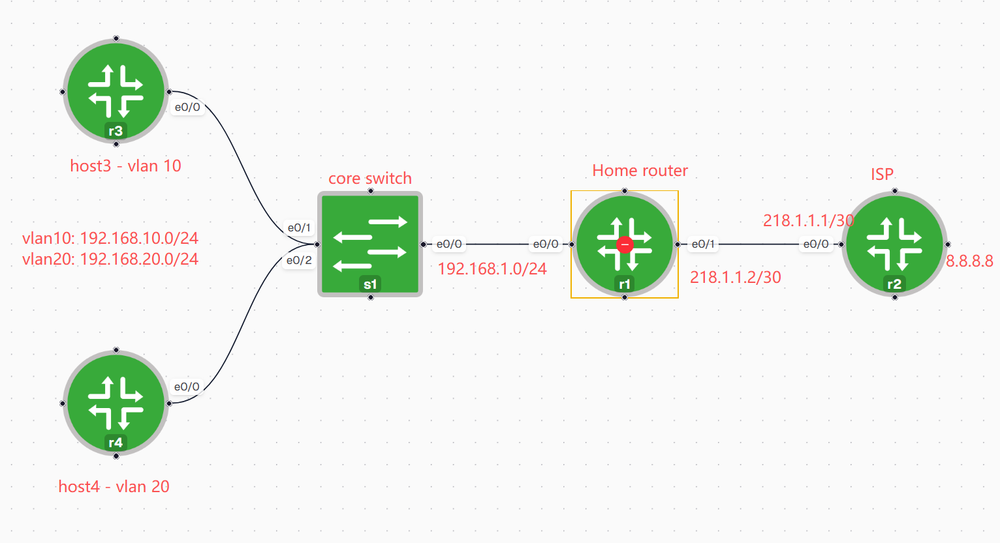

```bash
s1# sh run

ip routing

ip dhcp excluded-address 192.168.10.1 192.168.10.9
!
ip dhcp pool vlan10-pool
 network 192.168.10.0 255.255.255.0
 default-router 192.168.10.1
 dns-server 8.8.8.8
!
ip dhcp pool vlan20-pool
 network 192.168.20.0 255.255.255.0
 default-router 192.168.20.1
 dns-server 8.8.8.8
!
!
interface Ethernet0/0
 no switchport
 ip address 192.168.1.1 255.255.255.0
!
interface Ethernet0/1
 switchport access vlan 10
 switchport mode access
 duplex auto
!
interface Ethernet0/2
 switchport access vlan 20
 switchport mode access
 duplex auto
!
!
interface Vlan10
 ip address 192.168.10.1 255.255.255.0
!
interface Vlan20
 ip address 192.168.20.1 255.255.255.0
!
router ospf 1
 router-id 10.10.10.10
 passive-interface Vlan10
 passive-interface Vlan20
 network 0.0.0.0 255.255.255.255 area 0
!


r1(config)#do sh run
!
interface Ethernet0/0
 ip address 192.168.1.2 255.255.255.0
!
interface Ethernet0/1
 ip address 218.1.1.2 255.255.255.252
!
router ospf 1
 router-id 1.1.1.1
 network 0.0.0.0 255.255.255.255 area 0
 default-information originate
!
ip route 0.0.0.0 0.0.0.0 218.1.1.1

```

ACL:
需求1：让vlan10可以上网，vlan20不能上网

```bash
!
access-list 10 permit 192.168.1.0 0.0.0.255
access-list 10 permit 192.168.10.0 0.0.0.255
access-list 10 deny   any
!
interface Ethernet0/0
 ip access-group 10 in

# 或者
interface Ethernet0/1
ip access-g 10 out  # 不是最优

```

需求2：让vlan10可以访问7.7.7.7 port 23，但是不能访问8.8.8.8 ip

```bash

access-list 101 permit tcp 192.168.10.0 0.0.0.255 host 7.7.7.7 eq telnet
access-list 101 deny   ip 192.168.10.0 0.0.0.255 host 8.8.8.8
access-list 101 permit ip 192.168.20.0 0.0.0.255 any
access-list 101 permit ospf any any
interface Ethernet0/0
 ip access-group 101 in
```

```bash
ip access-list extended wangmingwei
 permit icmp any any
 permit tcp 192.168.10.0 0.0.0.255 host 7.7.7.7 eq telnet
 deny   ip 192.168.10.0 0.0.0.255 host 8.8.8.8
 permit ip 192.168.20.0 0.0.0.255 any
 permit ospf any any

interface Ethernet0/0
 ip access-group wangmingwei in
```
