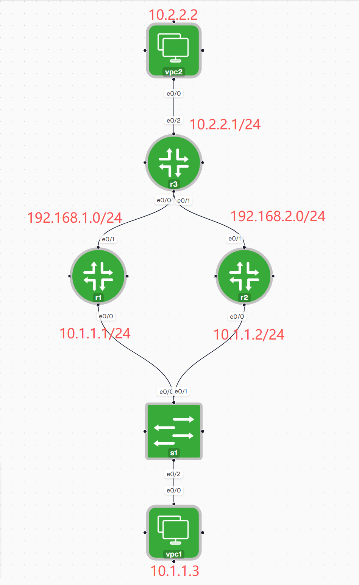

## VRRP 实现
```
r1#show run 
!
hostname r1
!
!
!
!
interface Ethernet0/0
 ip address 10.1.1.1 255.255.255.0
 standby 10 ip 10.1.1.254
 standby 10 priority 200
 standby 10 preempt
!
interface Ethernet0/1
 ip address 192.168.1.1 255.255.255.0
!
router ospf 1
 passive-interface Ethernet0/0
 network 10.1.1.0 0.0.0.255 area 0
 network 192.168.1.0 0.0.0.255 area 0
!
!


r2#show run
!
hostname r2
!
!
interface Ethernet0/0
 ip address 10.1.1.2 255.255.255.0
 standby 10 ip 10.1.1.254
!
interface Ethernet0/1
 ip address 192.168.2.1 255.255.255.0
!
!
router ospf 1
 passive-interface Ethernet0/0
 network 10.1.1.0 0.0.0.255 area 0
 network 192.168.2.0 0.0.0.255 area 0
!
!


r3#show run
!
hostname r3
!
!
interface Ethernet0/0
 ip address 192.168.1.2 255.255.255.0
!
interface Ethernet0/1
 ip address 192.168.2.2 255.255.255.0
!
interface Ethernet0/2
 ip address 10.2.2.1 255.255.255.0
!
!
router ospf 1
 passive-interface Ethernet0/2
 network 10.2.2.0 0.0.0.255 area 0
 network 192.168.0.0 0.0.255.255 area 0

```

## 输出
#### R1
```
r1#show vrrp brief 
Interface          Grp Pri Time  Own Pre State   Master addr     Group addr
Et0/0              10  200 3218       Y  Master  10.1.1.1        10.1.1.254     

```
#### R2
```
r2#show run int e0/0
interface Ethernet0/0
 ip address 10.1.1.2 255.255.255.0
 vrrp 10 ip 10.1.1.254
end

r2#sh vrrp br
Interface          Grp Pri Time  Own Pre State   Master addr     Group addr
Et0/0              10  100 3609       Y  Backup  10.1.1.1        10.1.1.254   
```


## 1. 什么是 FHRP？

**FHRP（First Hop Redundancy Protocol，第一跳冗余协议）** 用来解决**默认网关单点故障（Single Point of Failure）**的问题。它允许多个路由器共同提供一个**虚拟网关，当主路由器故障时，备用路由器自动接管，终端设备无需修改默认网关即可继续通信。

---

## 2. 为什么需要 FHRP？


```
         R1
       /
PC ---- Virtual Gateway ---- Internet
       \
         R2
```

PC 的默认网关始终是：

```
192.168.1.254（Virtual IP）
```

无论 R1 或 R2 工作，都不会影响 PC。

---

# 3. FHRP 工作原理

FHRP 创建两个虚拟信息：

- **Virtual IP（VIP）**
    
- **Virtual MAC（VMAC）**
    

PC：

```
Default Gateway = Virtual IP
```

实际负责转发的是其中一台路由器。

当 Active Router 挂掉：

```
Active → Standby
```

备用路由器立即接管 Virtual IP 和 Virtual MAC。

---

# 4. 三种 FHRP

| 协议   | 全称                                 | 是否 Cisco 专有 | 工作方式             | 是否负载均衡 |
| ---- | ---------------------------------- | ----------- | ---------------- | ------ |
| HSRP | Hot Standby Router Protocol        | ✔           | Active / Standby | ✘      |
| VRRP | Virtual Router Redundancy Protocol | ✘（RFC 标准）   | Master / Backup  | ✘      |


---

# 5. HSRP

### 特点

- Cisco 私有协议

```
        Active
PC ---------------> R1

        Standby
               R2
```

只有 Active 转发流量。

故障：

```
R1 Down

↓

R2 becomes Active
```

### 默认 Priority

```
100
```

Priority 越高：

越容易成为 Active。

---

## HSRP 选举规则

比较顺序：

```
Priority

↓

Highest IP Address
```

例如：

```
R1 Priority 120

R2 Priority 100
```

R1：

```
Active
```

若 Priority 相同：

```
IP 最大获胜
```

---

## HSRP Preemption

默认：

```
不会抢回 Active
```

例如：

```
R1 Active

↓

R1 Down

↓

R2 Active

↓

R1 恢复
```

默认：

```
R2 继续 Active
```

开启：

```
standby 1 preempt
```

恢复后：

```
R1 抢回 Active
```

---

# 6. VRRP

VRRP 与 HSRP 几乎一样。

区别：

- 开放标准（RFC）
    
- 可用于 Cisco、Huawei、Juniper 等多厂商设备
    
- 角色名称不同：
    
    - Master
        
    - Backup
        

默认 Priority：

```
100
```

特殊：

拥有 Virtual IP 的路由器默认 Priority 为：

```
255
```

