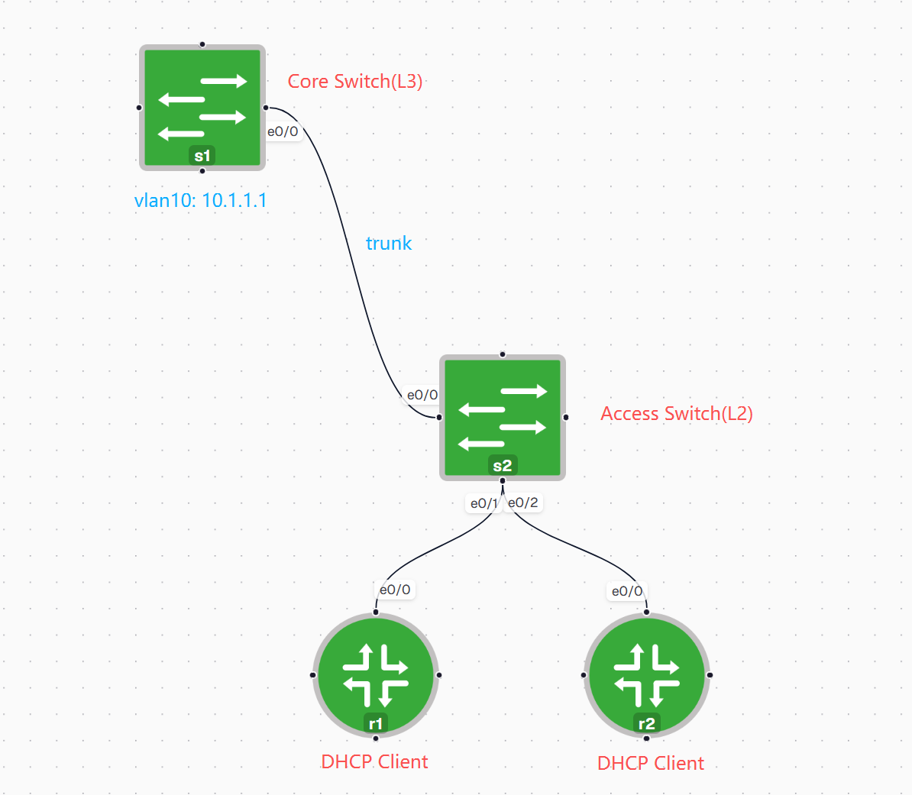

## 基础设置
### S1

```
hostname S1

vlan 10

ip dhcp excluded-address 10.1.1.1 10.1.1.10

ip dhcp pool V10
 network 10.1.1.0 255.255.255.0
 default-router 10.1.1.1

interface Loopback0
 ip address 1.1.1.1 255.255.255.255

interface Ethernet0/0
 switchport trunk encapsulation dot1q
 switchport mode trunk

interface Vlan10
 ip address 10.1.1.1 255.255.255.0
 no shutdown
```

---

### S2

```
hostname S2

vlan 10

interface Ethernet0/0
 switchport trunk encapsulation dot1q
 switchport mode trunk

interface Ethernet0/1
 switchport mode access
 switchport access vlan 10

interface Ethernet0/2
 switchport mode access
 switchport access vlan 10
```


---

### R1 / R2

```
interface Ethernet0/0
 ip address dhcp
 no shutdown
```

---

## DHCP Snooping

在 **S2** 上启用 DHCP Snooping：

```
ip dhcp snooping
ip dhcp snooping vlan 10
no ip dhcp snooping information option
```

将连接 DHCP Server 的 Trunk 接口设为 Trusted：

```
interface Ethernet0/0
 ip dhcp snooping trust
```

## 输出


```
MacAddress          IpAddress        Lease(sec)  Type           VLAN  Interface
AA:BB:CC:00:1C:00   10.1.1.11        74272       dhcp-snooping   10    Ethernet0/1
```

---

## Dynamic ARP Inspection


```
ip arp inspection vlan 10

interface Ethernet0/0
 ip arp inspection trust
 
interface Ethernet0/0
 no ip address dhcp
 ip address 10.1.1.20 255.255.255.0
```

随后发送 ARP，比如去ping 网关

## 输出

10.1.1.20 并不存在于列表中，DAI 会拒绝 ARP

所以s2 会出现

```
%SW_DAI-4-DHCP_SNOOPING_DENY:
Invalid ARPs on Et0/2, vlan 10
```

---

# Port Security


```
interface Ethernet0/2

 switchport mode access
 switchport access vlan 10

 switchport port-security
 switchport port-security mac-address sticky
 switchport port-security violation restrict
```

## 测试

```
interface Ethernet0/0
 ip address dhcp
 no shutdown
```

成功获取地址后，更改 MAC：

```
interface Ethernet0/0
 shutdown
 mac-address aabb.cc11.1111
 no shutdown
```

## 输出

由于 Sticky MAC 已记录原来的 MAC地址，新 MAC 会被认为非法


```
%PORT_SECURITY-2-PSECURE_VIOLATION:
Security violation occurred,
caused by MAC address aabb.cc11.1111
```

### Shutdown情况下


```
interface Ethernet0/2
 switchport port-security violation shutdown
```

再次更改 MAC 后：

```
Ethernet0/2 is down (err-disabled)
```

接口进入 **Err-disabled** 状态，就要以下更改

```
interface Ethernet0/2
 shutdown
 no shutdown
```

---

## 理论知识总结


## DHCP Snooping

DHCP Snooping 是交换机上的一种**二层安全功能**，主要用于防止**非法 DHCP Server（Rogue DHCP Server）**向客户端分配错误的 IP 地址

其工作原理是：

- 将交换机端口划分为 **Trusted（可信）** 和 **Untrusted（非可信）**
- 只有 Trusted 接口允许发送 DHCP Server 的报文
- 交换机会记录合法客户端的信息，生成 **DHCP Snooping Binding Table（绑定表）**，其中包括：
    
    - MAC 地址
    - IP 地址
    - VLAN
    - 接口
    - 租约时间（Lease）

---

## Dynamic ARP Inspection

ARP 协议本身没有身份验证，因此容易受到攻击。

Dynamic ARP Inspection的作用就是**检查收到的 ARP 报文是否合法**。

工作原理：

- 交换机收到 ARP 报文后，会检查其中的 **IP 地址** 和 **MAC 地址**
- 然后与 DHCP Snooping Binding Table 中记录的信息进行比对
- 如果 IP 与 MAC 不匹配，就认为是伪造的 ARP 报文，并直接丢弃

---

## Port Security

Port Security 用于**限制哪些设备可以连接到交换机端口**

Sticky MAC：

- 第一次接入的设备 MAC 地址会被交换机自动学习
- 学习后的 MAC 会保存到接口配置中
- 以后只有这个 MAC 地址可以继续使用该接口

如果有新的 MAC 地址接入，就会触发告警

- **Protect**：丢弃非法 MAC 的数据，不产生告警
- **Restrict**：丢弃非法数据，同时记录日志并增加违规计数
- **Shutdown**：直接将接口关闭（Err-disabled），需要管理员手动恢复
