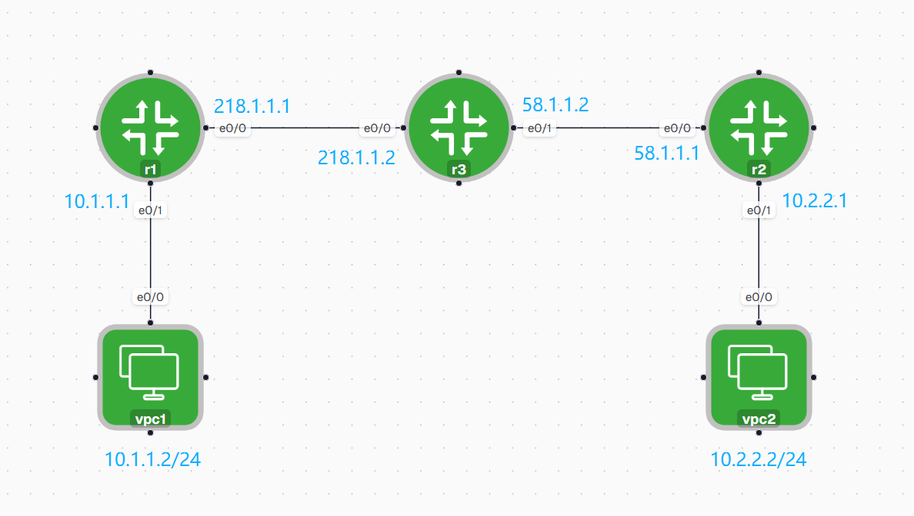
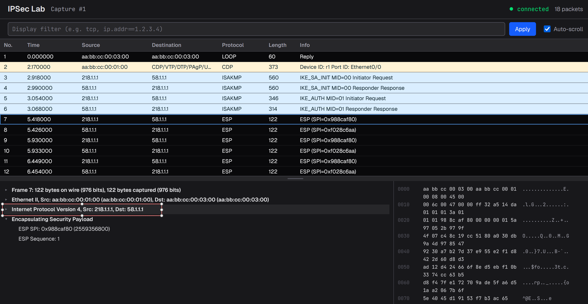

```bash
r1#show run
!
hostname r1
!
!
crypto ikev2 proposal ike-prop-1
 encryption aes-cbc-128
 integrity sha256
 group 14
!
crypto ikev2 policy ike-policy
 proposal ike-prop-1
!
crypto ikev2 keyring ike-keyring
 peer r2
  address 58.1.1.1
  pre-shared-key Cisco123
 !
!
!
crypto ikev2 profile ike-profile
 match identity remote address 58.1.1.1 255.255.255.255
 identity local address 218.1.1.1
 authentication remote pre-share
 authentication local pre-share
 keyring local ike-keyring
!
!
crypto ipsec transform-set myset esp-aes 256 esp-sha256-hmac
 mode tunnel
!
!
!
crypto map cisco 10 ipsec-isakmp
 set peer 58.1.1.1
 set transform-set myset
 set pfs group14
 set ikev2-profile ike-profile
 match address 101
!
!
!
!
!
interface Ethernet0/0
 ip address 218.1.1.1 255.255.255.0
 duplex auto
 crypto map cisco
!
interface Ethernet0/1
 ip address 10.1.1.1 255.255.255.0
 duplex auto
!
ip route 0.0.0.0 0.0.0.0 218.1.1.2
!
!
access-list 101 permit ip 10.1.1.0 0.0.0.255 10.2.2.0 0.0.0.255
!
```

---

```bash
r2#sh run
!
hostname r2
!
!
crypto ikev2 proposal ike-prop-1
 encryption aes-cbc-128
 integrity sha256
 group 14
!
crypto ikev2 policy ike-policy
 proposal ike-prop-1
!
crypto ikev2 keyring ike-keyring
 peer r1
  address 218.1.1.1
  pre-shared-key Cisco123
 !
!
!
crypto ikev2 profile ike-profile
 match identity remote address 218.1.1.1 255.255.255.255
 identity local address 58.1.1.1
 authentication remote pre-share
 authentication local pre-share
 keyring local ike-keyring
!
!
!
crypto ipsec transform-set myset esp-aes 256 esp-sha256-hmac
 mode tunnel
!
!
!
crypto map cisco 10 ipsec-isakmp
 set peer 218.1.1.1
 set transform-set myset
 set pfs group14
 set ikev2-profile ike-profile
 match address 101
!
!
interface Ethernet0/0
 ip address 58.1.1.1 255.255.255.0
 duplex auto
 crypto map cisco
!
interface Ethernet0/1
 ip address 10.2.2.1 255.255.255.0
 duplex auto
!
ip route 0.0.0.0 0.0.0.0 58.1.1.2
!
!
access-list 101 permit ip 10.2.2.0 0.0.0.255 10.1.1.0 0.0.0.255
!
```

---

```bash
r3#sh run
!
hostname r3
!
interface Ethernet0/0
 ip address 218.1.1.2 255.255.255.0
!
interface Ethernet0/1
 ip address 58.1.1.2 255.255.255.0
!
```

IPSec 不像 GRE 那样，需要依赖指向 Tunnel 接口的路由，把流量送到隧道上。

IPSec 没有 Tunnel 接口，它依赖的是 **感兴趣流（Interesting Traffic）**。

因此需要使用 ACL 来定义哪些流量需要加密。

对于 R1 来说：“access-list 101 permit ip 10.1.1.0 0.0.0.255 10.2.2.0 0.0.0.255”，表示：

> 从 10.1.1.0/24 到 10.2.2.0/24 的流量需要通过 IPSec 进行加密传输。

Crypto Map 中：“match address 101”，表示：

> 当路由器发现有数据包匹配 ACL 101 时，就认为这是**感兴趣流**，自动启动 IPSec 协商。

注意：ACL **不会决定路由**。路由仍然按照普通路由表查找（这里默认路由指向 R3），只是数据包在发出去之前，会被 IPSec 捕获并加密。

---

## IPSec 建立过程

当第一包感兴趣流出现时，例如：

```
PC1
10.1.1.2
      │
      │ ping
      ▼
10.2.2.2
```

R1 发现：10.1.1.2 → 10.2.2.2 匹配 ACL 101。

于是不会立即发送普通 IP 数据包，而是开始与 R2 建立 IPSec 隧道。

整个协商使用 **IKE（Internet Key Exchange）** 完成。IKE 也被称为 ISAKMP（Internet Security Association and Key Management Protocol） ，它是建立 IPSec 隧道所使用的协商协议。

本实验使用的是 **IKEv2**。整个过程可以理解为两个阶段。

---

## 第一阶段（IKE SA）

第一阶段的目标是：

> **建立一个安全的协商通道。**

双方会协商：

- 使用哪种加密算法
  - AES-128

- 使用哪种完整性算法
  - SHA-256

- 使用哪个 DH 组
  - Group 14

- 使用什么身份认证方式
  - Pre-shared Key（预共享密钥）

随后双方验证预共享密钥(Cisco123)是否一致。如果一致，就建立第一阶段的安全关联（IKE SA）。

此时双方拥有了一条**安全的控制通道**，以后所有 IPSec 参数都将在这条安全通道中协商。

---

## 第二阶段（IPSec SA）

第一阶段完成后，开始第二阶段。

第二阶段的目标是：

> **建立真正用来传输业务数据的 IPSec 隧道。**

双方继续协商：

- 使用什么加密算法
  - ESP(Encapsulating Security Payload) AES-256

- 使用什么完整性算法
  - ESP SHA256

- 是否启用 PFS
  - Group14

- 哪些流量需要加密
  - ACL 101

第二阶段成功后，会建立 IPSec SA。

---

到此，隧道建立完毕，之后就可以正常转发数据了：

在R1与R3的链路上抓包：



```
10.1.1.2
    │
    ▼
【R1 感知感兴趣流，将IP包头10.1.1.2 → 10.2.2.2和 payload 原封不动 加密ESP，并且打上新的包头（从隧道起点218.1.1.1到终点58.1.1.1）】
    │
  【R3 只能看到外层包头218.1.1.1 → 58.1.1.1，往下一跳转发】
    │
【R2 解析外层IP包头，解密ESP，看到内层包头10.1.1.2 → 10.2.2.2】
    │
    ▼
10.2.2.2
```

### CCNA 学生需要记住的四句话（足够应对考纲）

1. **ACL 定义 Interesting Traffic（感兴趣流），决定哪些流量需要加密。**
2. **Crypto Map 将 ACL、Peer、Transform Set 和 IKE Profile 关联起来，并应用到出口接口。**
3. **IKE Phase 1（IKE SA）负责建立安全协商通道并完成身份认证。**
4. **IKE Phase 2（IPSec SA）负责协商数据加密参数，之后真正开始加密传输业务流量。**

## Remote VPN 与 Site-to-Site VPN 的区别

### Site-to-Site VPN（站点到站点 VPN）

两端通常都是 VPN 网关（如 Cisco 路由器、防火墙），用于连接不同地点的局域网。

例如：

```text
Branch LAN 10.1.1.0/24
      │
  VPN Router
      │
==== Internet ====
      │
  VPN Router
      │
HQ LAN 10.2.2.0/24
```

特点：

- 连接两个局域网（LAN 到 LAN）
- VPN 隧道长期保持可用
- 用户无感知
- 两端需要固定的公网 IP

---

### Remote VPN（远程接入 VPN）

远程员工使用 VPN Client（如 Cisco Secure Client）通过 Internet 接入公司网络。

例如：

```text
Laptop
  VPN Client(Cisco Secure Client / Cisco Anyconnect Client / Cisco VPN Client)
     │
==== Internet ====
     │
  HQ VPN Router
     │
Company LAN
```

特点：

- 连接移动用户到企业网络
- 需要 VPN Client 发起连接
- 用户需要登录认证（用户名、密码、证书等）
- 常用于居家办公、出差办公
- vpn client 端 IP 不固定，但是 HQ VPN Router需要固定公网 IP
