# CCNA 200-301 QoS 模块讲义

---

## 一、为什么网络需要 QoS

先建立场景，再讲机制,学生才有动机。

一条链路的带宽是固定的。当某一时刻进入某台设备的流量总和超过了出接口能发送的速率，设备只有两个选择：把多出来的包存进缓冲区排队，或者缓冲区满了之后直接丢弃。这个瞬间叫**拥塞（congestion）**。

如果不做任何区分，所有流量在拥塞时得到的对待是一样的——先来后到，排不上就丢,这叫 **best-effort（尽力而为）**转发,是默认行为。问题在于,不同类型的流量对"排队"和"丢包"的容忍度完全不同。一段语音通话对延迟和抖动极其敏感,晚到 200ms 就等于没用;而一次文件下载哪怕多等几秒也毫无影响,丢几个包 TCP 会自动重传。QoS 要解决的核心问题就是:**在带宽不够用的时候,谁先走、谁该等、谁可以被丢——这个决策要交给网络管理员,而不是先到先得的运气**。

有一点必须在一开始就讲清楚，也是学生最容易忘的:**QoS 不创造带宽,它只是在带宽不够用的那一刻做出选择**。链路完全空闲的时候,QoS 策略实际上什么都不做,因为没有资源可抢。

---

## 二、分类与标记（Classification and Marking）

这是整条 PHB（Per-Hop Behavior） 链条的第一步,也是后面所有环节能工作的前提——你必须先知道"这是什么流量",才能决定"怎么对待它"。

**分类（Classification）**是识别流量的过程。设备看包的哪些字段——源/目的地址、端口号、协议类型，甚至应用层特征——来判断这个包属于哪一类业务（语音、视频、关键业务数据、普通数据）。分类本身不改变包的任何内容,只是打上一个"这是A类"的内部标签,给后续环节用。

**标记（Marking）**是把分类的结果写进包头里,让下游设备不用重新做深度分析就能直接读出优先级。CCNA 层面需要知道两个标记字段放在哪:

- **Layer 2 标记**:**CoS（Class of Service）**,也叫PCP（Priority Code Point）,802.1Q 标签里的 3 个 bit,只在同一个二层域内有效,过了路由器就没了。

- **Layer 3 标记**:IP 头里的 **DSCP（Differentiated Services Code Point）**, 6 个 bit,端到端都能带着走,是现代网络里的主力标记字段

直觉性的类比:

- CoS 像是快递包裹上贴的一张便利贴,只在这一个仓库内部有效;
- DSCP 像是写在包裹面单上的正式标签,从始发地一路带到目的地,每一站都认。

**信任边界（Trust Boundary）**

- 网络边缘的终端设备（PC、手机）发出来的包,它自己标记的 CoS/DSCP 是不可信的：任何用户都能改自己电脑的设置,把普通流量标成最高优先级。
- 所以标记这件事,通常应该发生在入口设备上（例如：接入交换机、或者路由器）,而不是相信终端自己打的标签。这个"从这里开始信任标记"的点,就是信任边界。

---

## 三、排队与拥塞管理（Queuing）

分类打好标签之后,到了真正拥塞的那一刻,设备要决定谁先出接口。这就是排队要解决的问题。

最原始的模型:**FIFO（先进先出）**：所有包挤在一个队列里,谁先到谁先走,不区分优先级。这是没有 QoS 时的默认行为。

**多队列**的思路:把不同优先级的流量分进不同队列,再决定哪个队列先出。例如：给语音这类延迟敏感的流量开一条"绿色通道",不用跟大文件下载挤在同一个队列里。

常见的队列调度算法有：PQ、CQ、WFQ、CBWFQ、LLQ，以LLQ举例：

**LLQ（Low Latency Queuing）** 给语音流量一个绝对优先、但设了带宽上限的严格优先队列,其余流量按公平方式排队。

---

## 四、拥塞避免（Congestion Avoidance）

和上面的排队（Queuing）是两件事：排队是"拥塞已经发生了,谁先走",拥塞避免是"想办法让拥塞晚一点发生、发生得更平缓"。

经典问题:**尾部丢弃（Tail Drop）**。当队列缓冲区满了,默认行为是新来的包直接在队尾被丢弃,不管是谁的包。
如果此时有大量 TCP 连接同时经过这台设备,它们几乎会同时检测到丢包,同时触发拥塞控制、同时降速,然后又几乎同时恢复速度,再次一起把队列打满。
这个现象叫 **TCP 全局同步（TCP Global Synchronization）**,会导致链路利用率像心跳一样上下剧烈波动,而不是平稳跑在高利用率上。

**WRED（Weighted Random Early Detection）**就是为了解决这个问题存在的。核心思路是:在队列还没满之前,就开始按概率随机丢弃一部分包,而且优先级越低的流量被丢的概率越高。这样做的效果是,不同的 TCP 连接会在不同时间点各自感知到丢包、各自降速,避免了"所有人同时降速再同时冲高"的同步现象,让链路利用率更平滑。

---

## 五、Policing and Shaping

几乎每一版 CCNA 模拟题都会考这个对比。

两者要解决的问题是一样的:**限制某类流量不能超过一个约定好的速率**。但对"超速的包"怎么处理,是两者唯一但关键的区别:

**Policing**对超出速率的包,做法是**丢弃**(或者重新打上更低优先级的标记再放行)。它不缓冲、不等待,超了就是超了,直接处理掉。效果是流量曲线看起来有很多毛刺,该丢的时候立刻丢,平均速率被压住了,但瞬时突发完全没有被抹平。

**Shaping**对超出速率的包,做法是先**存进缓冲区里排队等待**,等到有富余带宽的时候再按约定速率慢慢发出去,而不是直接丢弃。效果是流量曲线被"熨平"了,牺牲的是延迟(包在缓冲区里多等了一会儿),换来的是更少丢包。

一个好记的类比:

- Policing 像是收费站的硬性限速——超速直接开罚单(丢包);
- Shaping 像是给车流前面加一个红绿灯,把车流均匀放行,不会有车被直接拦下不让走,但会堵一会儿。

再补一句应用场景的直觉:

- Policing 更常用在网络入口处(比如 ISP 限制客户接入带宽,这也是为什么运营商合同里的带宽限制大多是靠 policing 实现的),因为入口设备通常不希望为超标流量消耗缓冲区资源;
- Shaping 更常用在出接口带宽本身就比上游窄的场景(比如从高速局域网口发往低速广域网链路),用缓冲区去匹配下游能承受的速率。

---

## 六、附录:无线场景里顺带出现的 QoS

WLC 图形界面创建 WLAN 时会看到 "QoS profile" 这个选项(Platinum/Gold/Silver/Bronze 四档,分别对应 语音/视频/尽力而为/后台流量),这不是一个独立考点,只是要求学生在做 WLAN 配置操作题时,认得这个下拉菜单里的选项是什么意思。

## 七、复习检查清单

自查,能不能脱稿说清楚这几件事:

- 为什么网络需要 QoS,以及"QoS 不创造带宽"这句话是什么意思
- 分类和标记的区别,以及 CoS 和 DSCP 分别在哪一层、作用范围有多大
- 什么是信任边界,为什么终端设备自己打的标记不可信
- 排队要解决的问题是什么,为什么需要不止一个队列
- 什么是尾部丢弃,什么是 TCP 全局同步,WRED 怎么缓解这个问题
- Policing 和 Shaping 的核心区别(丢包 vs 缓冲延迟),各自更常用在什么位置
