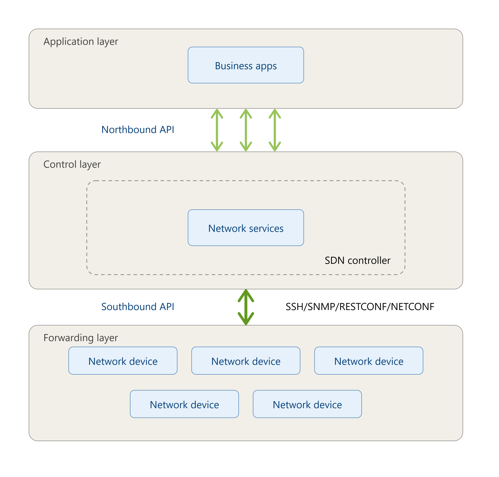

# 自动化

## 南北向接口

## REST API

[http basic](./http_basic.md)

[restconf](./http_restconf.md)

## Ansible

Ansible 定位是**配置管理**（configuration management），面向已经存在的设备，去推送和维持配置状态，而不是创建资源本身。它是 agentless 的，不需要在目标设备上安装代理软件，靠 SSH（对网络设备而言）去连接执行——这一点对网络场景尤其重要，因为路由器交换机没法像服务器一样装 agent。它属于 push 模型，由控制节点主动把变更推给目标设备；配置逻辑写在 YAML 格式的 playbook 里，语法是过程式的，描述"按顺序做哪些操作"。执行结果具备幂等性：同一个 playbook 反复运行，只要设备已经处于期望状态，就不会重复产生变更。

考试角度记住这几个关键词即可：agentless、push、YAML、SSH、幂等（idempotent）。

[ansible](./ansible_example/README.md)

## Terraform

Terraform 定位是**基础设施即代码**（Infrastructure as Code），核心用途是创建和管理基础设施资源的生命周期，而不是修改已有设备的运行配置。它是声明式（declarative）的，用 HCL 语法描述"最终应该达到的状态"，而不是过程式地写执行步骤。Terraform 会维护一个 state 文件，记录它当前管理的资源的实际状态；每次执行时，它对比声明的目标状态和 state 文件里记录的实际状态，计算出差异，再调用对应 provider 的 API 去完成创建、修改或销毁操作。

考试角度记住这几个关键词即可：declarative、HCL、state 文件、资源生命周期管理（provisioning）。

[terraform](./terraform_example/README.md)

[terraform](./terraform_example2/README.md)

### 两者的本质区别

Ansible 靠过程式脚本把设备推向期望配置；Terraform 管的是"资源本身的生命周期"，靠声明式描述加 state 对比来决定要不要创建或销毁资源。
